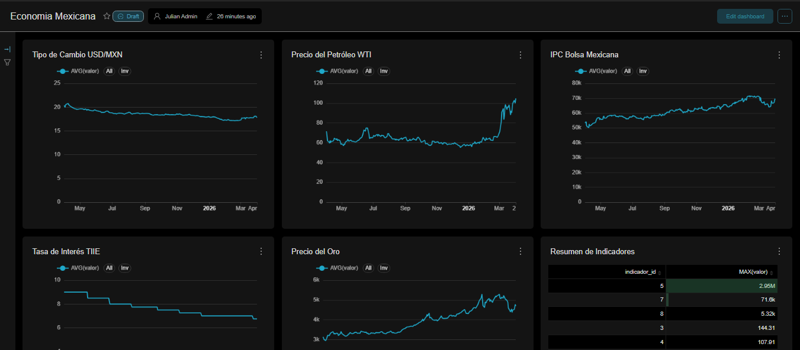
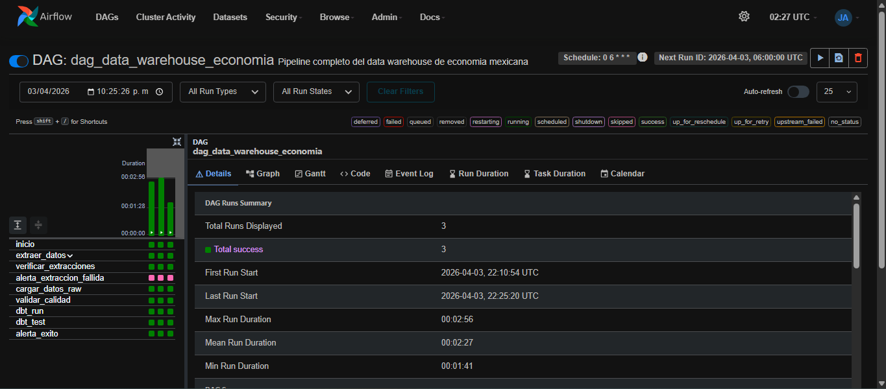
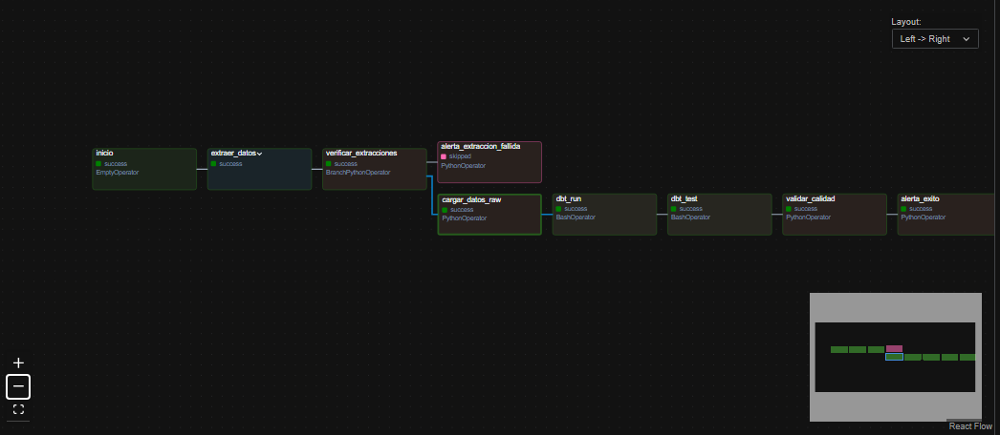
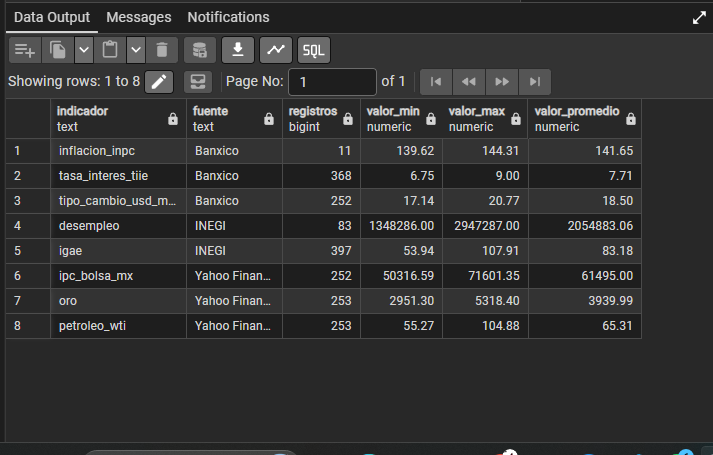
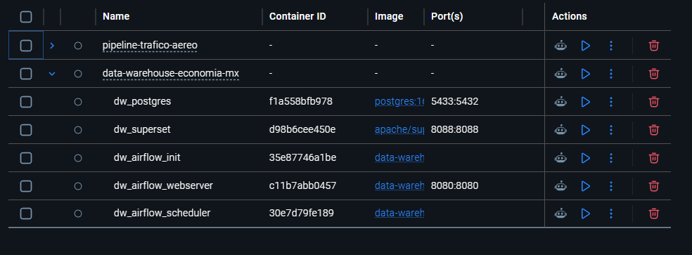

<div align="center">

# Data Warehouse — Economía Mexicana

**Pipeline ELT end-to-end para indicadores económicos de México**

Extracción automatizada de 4 APIs · Modelo dimensional en PostgreSQL · Orquestación con Airflow · Validación con Great Expectations · Dashboard en Superset · Despliegue con Docker Compose

<br>


<br><br>



</div>

---

## Descripción

Sistema de datos que centraliza 8 indicadores económicos de México desde 4 fuentes heterogéneas (Banxico, INEGI, Yahoo Finance, OpenSky) en un data warehouse con modelo dimensional **star schema**. El pipeline ELT está completamente orquestado con Airflow, validado con Great Expectations, visualizado en Superset y containerizado con Docker Compose — listo para levantarse en cualquier entorno con un solo comando.

---

## Métricas del Sistema

| Métrica | Valor |
|---|---|
| Fuentes de datos | 4 APIs (Banxico, INEGI, Yahoo Finance, OpenSky) |
| Indicadores económicos | 8 (tipo de cambio, TIIE, inflación, IGAE, desempleo, petróleo, bolsa, oro) |
| Modelos dbt | 17 (9 staging · 3 intermediate · 5 marts) |
| Validaciones automáticas | 21 expectativas sobre 5 tablas |
| Tareas del DAG | 12 (con Task Groups, BranchOperator y alertas) |
| Servicios Docker | 4 (PostgreSQL, Airflow Webserver, Airflow Scheduler, Superset) |
| Tiempo de ejecución end-to-end | ~3 minutos |

---

## Arquitectura

```
  Banxico API ──┐
  INEGI API ────┤    ┌────────────┐    ┌────────────┐    ┌─────────────────┐    ┌────────────┐    ┌───────────┐
  Yahoo Fin. ───┼──▶ │ Extracción │──▶ │ PostgreSQL │──▶ │ dbt (3 capas)   │──▶ │ Validación │──▶ │ Superset  │
  OpenSky ──────┘    │  (Python)  │    │   (raw)    │    │ stg/int/marts   │    │    (GE)    │    │ Dashboard │
                     └────────────┘    └────────────┘    └─────────────────┘    └────────────┘    └───────────┘

                     └───────────────────── Apache Airflow (orquestación) ──────────────────────┘
                     └───────────────────── Docker Compose (infraestructura) ───────────────────┘
```

---

## Modelo Dimensional

Star schema con 3 dimensiones y 1 tabla de hechos:

```
    dim_fecha                 fact_indicadores_economicos              dim_indicador
  ┌──────────────┐          ┌──────────────────────────┐          ┌──────────────────┐
  │ fecha (PK)   │          │ id (PK)                  │          │ indicador_id (PK)│
  │ anio         │◀────────▶│ fecha (FK)               │◀────────▶│ nombre           │
  │ mes, dia     │          │ indicador_id (FK)        │          │ descripcion      │
  │ trimestre    │          │ fuente_id (FK)           │          │ unidad           │
  │ dia_semana   │          │ valor                    │          │ frecuencia       │
  │ es_festivo   │          │ valor_anterior           │          └──────────────────┘
  └──────────────┘          │ variacion_porcentual     │
                            │ promedio_movil_7d        │          dim_fuente
                            │ promedio_movil_30d       │        ┌──────────────────┐
                            └──────────────────────────┘        │ fuente_id (PK)   │
                                       ▲                        │ nombre           │
                                       └───────────────────────▶│ url_api          │
                                                                └──────────────────┘
```

### Fuentes de datos

| Fuente | Indicadores | Frecuencia |
|---|---|---|
| **Banxico** | Tipo de cambio USD/MXN, Tasa TIIE, Inflación INPC | Diaria / Mensual |
| **INEGI** | IGAE (Actividad Económica), Desempleo | Mensual / Trimestral |
| **Yahoo Finance** | Petróleo WTI, IPC Bolsa Mexicana, Oro | Diaria |
| **OpenSky** | Tráfico aéreo sobre México | Tiempo real |

---

## Technical Highlights

**Modelo dimensional star schema con transformaciones en 3 capas dbt**
La capa de transformación está estructurada siguiendo el patrón `staging → intermediate → marts` de dbt, con 17 modelos SQL que aplican limpieza, tipado, uniones y cálculo de métricas derivadas (variación porcentual, promedios móviles de 7 y 30 días usando window functions). El resultado es un star schema consumible directamente por herramientas de BI.

**Orquestación avanzada con Task Groups, BranchOperator y alertas**
El DAG de Airflow implementa 12 tareas agrupadas en Task Groups lógicos, con `BranchPythonOperator` para flujo condicional según el estado de ejecución y callbacks `on_failure_callback` / `on_success_callback` para alertas automáticas. La detección de entorno es dinámica: el mismo DAG funciona tanto en WSL local como en Docker.

**Validación programática con Great Expectations y EphemeralDataContext**
Se implementaron 21 expectativas automáticas sobre 5 tablas del data warehouse. El uso de `EphemeralDataContext` evita la persistencia de estado entre validaciones. Para sortear el bug conocido de reutilización de contexto en GE 1.x, cada tabla se valida en un contexto aislado, evitando contaminación cruzada.

**Resolución de conflicto de namespace entre directorio local y paquete pip**
El directorio `great_expectations/` del proyecto colisionaba con el paquete pip del mismo nombre al importarlo desde Airflow. La solución fue ejecutar las validaciones vía `subprocess` en lugar de import directo, aislando completamente los namespaces.

**Infraestructura multi-servicio con Docker Compose, healthchecks y volúmenes persistentes**
El sistema levanta 4 servicios (PostgreSQL, Airflow Webserver, Airflow Scheduler, Superset) con dependencias declaradas por `healthcheck` y volúmenes persistentes para datos y logs. Todo el stack se levanta con un solo `docker compose up --build` en ~2 minutos.

**Adaptación a migración de API de INEGI de BIE a BISE**
INEGI migró su API de BIE a BISE en diciembre de 2025, rompiendo los endpoints documentados. Se adaptaron los scripts de extracción a los nuevos endpoints y se implementó cobertura de INPC vía Banxico como fuente alternativa de respaldo, garantizando que el pipeline siga funcionando sin degradación.

---

## Quick Start

> **Requisito:** [Docker Desktop](https://www.docker.com/products/docker-desktop/) instalado y corriendo.

```bash
git clone <url-del-repo>
cd data-warehouse-economia-mx

cp .env.example .env          # Configurar tokens de Banxico e INEGI
docker compose up --build     # Levantar todo el sistema (~2 min)
```

### Servicios expuestos

| Servicio | URL | Credenciales |
|---|---|---|
| Airflow | `http://localhost:8080` | admin / admin |
| Superset | `http://localhost:8088` | admin / admin1 |
| PostgreSQL | `localhost:5433` | postgres / 12345 |

Activar y ejecutar el DAG `dag_data_warehouse_economia` desde Airflow. El pipeline corre end-to-end en ~3 minutos.

```bash
docker compose down           # Apagar todos los servicios
```

---

## Screenshots

<table>
<tr>
<td width="50%">

**Dashboard — Superset**


</td>
<td width="50%">

**Pipeline ejecutado — Airflow**


</td>
</tr>
<tr>
<td width="50%">

**Grafo del DAG**


</td>
<td width="50%">

**Datos en PostgreSQL**


</td>
</tr>
<tr>
<td colspan="2">
<div align="center">

**Servicios Docker Compose**


</div>
</td>
</tr>
</table>

---

## Stack

| Capa | Tecnología | Implementación |
|---|---|---|
| **Extracción** | Python, Requests, yfinance | 4 scripts con logging, manejo de errores y reintentos |
| **Almacenamiento** | PostgreSQL 16 | 4 esquemas (raw → staging → intermediate → marts) |
| **Transformación** | dbt 1.11.7 | 17 modelos SQL, window functions, promedios móviles |
| **Validación** | Great Expectations 1.15 | 21 expectativas programáticas con `EphemeralDataContext` |
| **Orquestación** | Apache Airflow 2.10.5 | Task Groups, `BranchPythonOperator`, alertas de fallo/éxito |
| **Visualización** | Apache Superset | 6 charts (líneas, tabla resumen) en dashboard interactivo |
| **Infraestructura** | Docker Compose | Multi-container con healthchecks y volúmenes persistentes |

---

## Estructura del Proyecto

```
data-warehouse-economia-mx/
├── src/
│   ├── extract/                    # 4 scripts de extracción (1 por API)
│   ├── load/
│   │   └── load_raw.py             # Carga a esquema raw
│   └── utils/
│       └── helpers.py              # Logging, env vars, JSON
│
├── dbt_project/models/
│   ├── staging/                    # 9 modelos — limpieza y tipado
│   ├── intermediate/               # 3 modelos — unión y métricas derivadas
│   └── marts/                      # 5 modelos — star schema final
│
├── great_expectations/
│   └── validate_data.py            # 21 validaciones sobre marts
│
├── airflow/dags/
│   └── dag_data_warehouse.py       # DAG con detección automática de entorno
│
├── init-sql/                       # DDL de esquemas y tablas raw
├── Dockerfile                      # Imagen base Airflow + dependencias
├── docker-compose.yml              # PostgreSQL + Airflow + Superset
├── requirements.txt
└── .env.example
```

---

## Decisiones Técnicas

| Problema | Solución |
|---|---|
| INEGI migró su API de BIE a BISE (dic. 2025), rompiendo endpoints documentados | Adaptación a nuevos endpoints; cobertura de INPC vía Banxico como fallback |
| Great Expectations 1.x falla silenciosamente al reusar `EphemeralDataContext` | Contexto aislado por tabla, evitando contaminación de estado |
| Conflicto de namespace entre directorio `great_expectations/` y el paquete pip | Ejecución de validaciones vía `subprocess` para aislar imports |
| Airflow no soporta Windows nativamente | DAG con detección automática de entorno (WSL vs Docker) y ajuste dinámico de rutas |
| Tablas de marts no existen al primer arranque en Docker | Reordenamiento de dependencias en el DAG: dbt se ejecuta antes de la validación |

---

## Roadmap

- [ ] Carga incremental (actualmente full refresh)
- [ ] Alertas por Slack/email ante fallos del pipeline
- [ ] Fuentes adicionales: remesas, balanza comercial, PIB
- [ ] CI/CD con GitHub Actions
- [ ] Gráficas de correlación entre indicadores en Superset

---

## Licencia

MIT — ver [LICENSE](LICENSE).

---

## Contacto

**Julian Flores Salgado**
Ingeniero en Sistemas Computacionales — Tecnológico Nacional de México
Data Engineer · Python Developer

🔗 **[LinkedIn](https://www.linkedin.com/in/julian-flores-salgado)**
[](mailto:juliianfs10@gmail.com)
